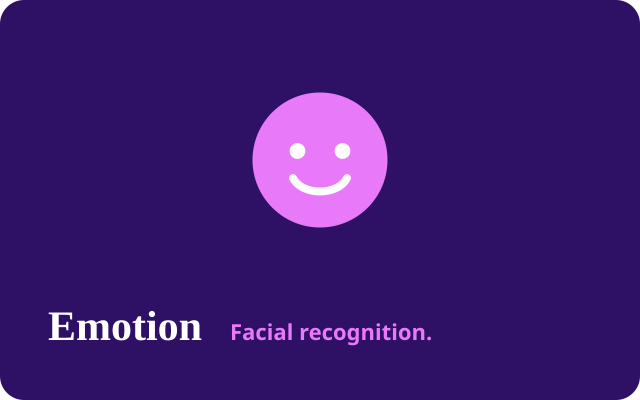

<!-- portfolio-sync:start -->

  

# Facial Emotion Recognition

  

CNN classifier for 7 facial emotions with low-light/occlusion augmentation (TensorFlow/Keras, OpenCV).

**Live demo:** [https://yashthavkar.com/emotion.html](https://yashthavkar.com/emotion.html)  
**Portfolio write-up:** [https://yashthavkar.com/project-detail.html?p=emotion-cnn](https://yashthavkar.com/project-detail.html?p=emotion-cnn)

---
<!-- portfolio-sync:end -->
# Facial-Emotion-Recognition-CNN-
Built a CNN to classify 7 facial emotions and improved robustness using low-light/occlusion augmentation (TensorFlow/Keras, OpenCV).

